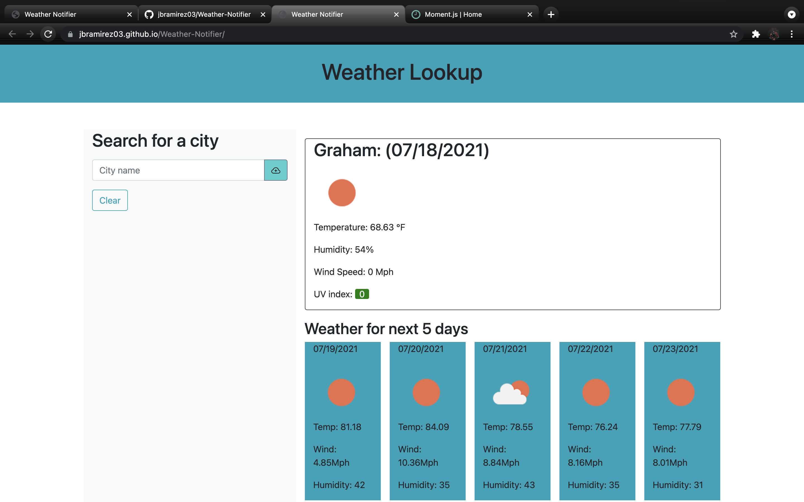
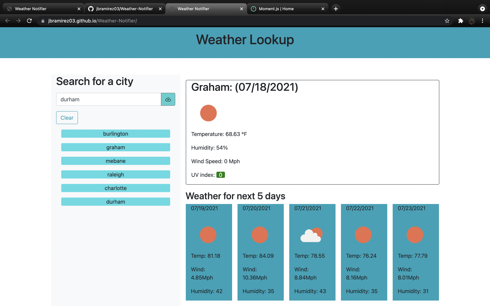
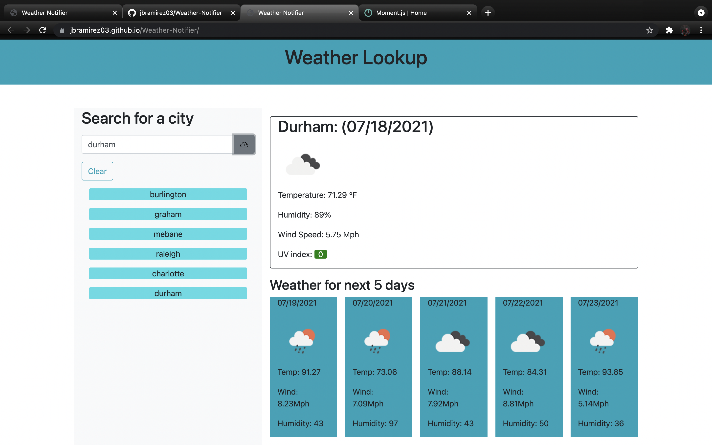

*<h1>Weather Notifier</h1>*
<h1 align="center">Overview</h1>

## This website allows you to enter any city and the current weather for that city is displayed along with the next five days in the week.   Now you can plan accordingly for the week knowing what all the weather conditions are for your city.  

## How it works: 
1. For any city to appear you must first enter a city name into the search text box.
2. You must then click the button beside the search bar with an icon inside
3. Once you do both a function is triggered that makes a call to an api and the data from that api is rendered on the screen

### In-depth description:
* How this works is there are pre made divs in the html that will contain the information returned from the api call
* Through the use of javascript a function goes through the api and sets the premade div's `textContent` to the values in the api
* The reason data is rendered in rows is through the use of the css framework [BootStrap](https://getbootstrap.com/)
* In html divs are given classes that give certain styles and can position things in the document depending on the class name
* [Moment.Js](https://momentjs.com/) was also used in this page in order to convert a unix timecode in the api data pertaining to a certain day into a readable date
* Lastly `localStorage` was used in order to save the last rendered city data and display it upon refresh or upon return to site

### Improvements to be made: 
* In the javascript file a function to call the api was repeated in order to work once a user clicked a previously searched city
* This could be improved by just making one function with a set of parameters and then make two different event listeners that call the function with defined parameters
* There could be more custom styling done on the page to make it stand out more  

# Demo: 

## Last searched city renders on revisit to site
  

## Insert city name
  

## Click button in order to search for city
  

## Link to live site:
*[Github page](https://jbramirez03.github.io/Weather-Notifier/)*

